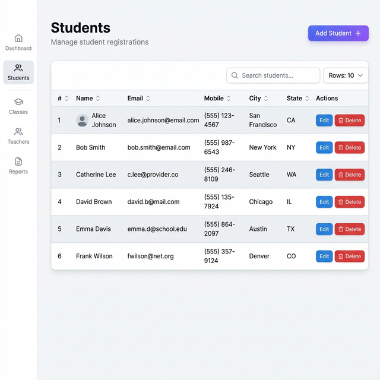
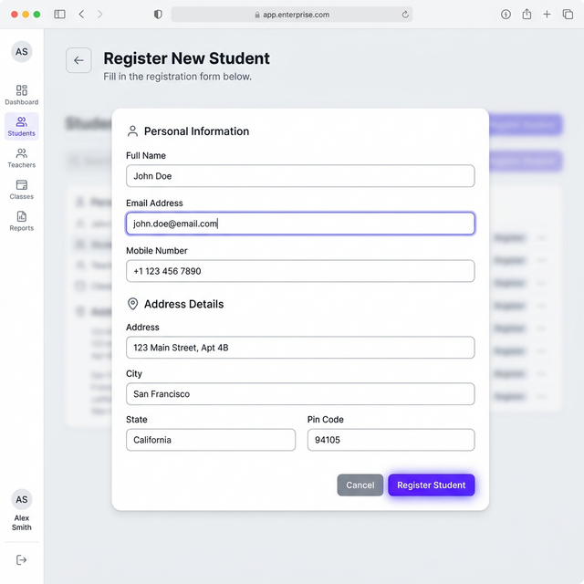

# Enterprise Student Registration System

A complete full-stack web application designed for managing student registrations with enterprise-grade architecture. Built using ASP.NET Core 8 Web API for a robust, Clean Architecture backend and Angular 17+ with standalone components for a fast, reactive frontend. Features include full CRUD operations, pagination, FluentValidation, and a beautiful Bootstrap 5 UI.

### App Screenshots




### Docker 
```bash
docker-compose up --build
